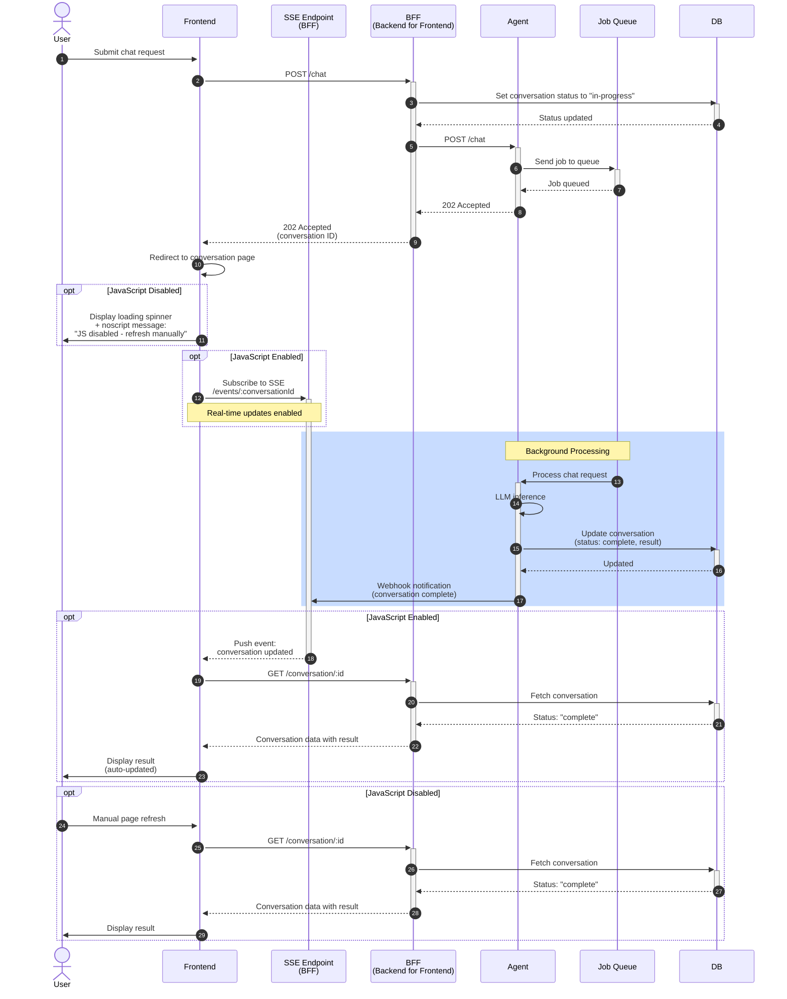

# Loading Spinner / Typing Animation

This example implements the simplest form of asynchronous chat interface interactions that adheres to GDS progressive enhancement principles. It provides a baseline experience that works for all users, with optional JavaScript enhancements.

## Baseline (Assumption that JavaScript is disabled)

Instead of making users wait in a synchronous request, we decouple the message submission from the response.

When a user submits their message through a standard HTML form, the server immediately accepts it and queues it for processing in the background. The user is then redirected to the conversation page that shows a branded loading indicator (like a spinner or typing animation), along with clear messaging such as "Your message is being processed. Refresh this page to see the response." The page also displays the current status of the conversation.

This is the core interaction pattern. It works with JavaScript disabled, screen readers and assistive technologies, text-only browsers, and slow or unreliable connections.

Because the server responds immediately, there are no timeout errors. Signposted by the prompt / messaging alongside the loading indicator, users understand that the service is working and that they need to refresh for updates. This is a much better experience than a generic browser loading indicator or an unbranded timeout error page.

## Progressive enhancement (JavaScript enabled)

For users with JavaScript, the manual refresh step can be eliminated. We can prevent the default form submission and instead subscribe to real-time updates via one of:
- Server-Sent Events (SSE)
- WebSockets
- Polling

When the server processes the message and updates the conversation status, it can push an event to the client. The client listens for this event and automatically updates the page with the response when it's ready. The loading indicator can be replaced with a typing animation or status updates to show progress. The complexity of the update can be as simple or as sophisticated as needed, for example, it could trigger a full refresh of the page, or stream back the response in real-time as it's generated by the LLM.

The conversation page checks for updates and automatically displays the AI response when ready. The typing animation or status updates appear without user intervention, and the response simply appears in the conversation when it's ready. Users don't need to do anything—it just works.

The key is that this enhancement is optional. The service remains fully functional without it, adhering to GDS guidance that JavaScript should be used to enhance, not enable, core functionality.

## Why this works

This pattern aligns with GDS progressive enhancement because the baseline works for everyone - no user is excluded regardless of the status of their JavaScript, assistive technology, or connection quality. The enhancements provide a better experience for users with modern browsers and JavaScript enabled, but they are not required for the service to function. The core loop of submitting a message and receiving a response is decoupled, which is also a much improved architecture choice for handling long-running processes, not just for LLMs but for any operation that may take time to complete. This approach eliminates timeout risks and gives users control over their experience, while still providing a branded, in-page loading indicator that manages expectations effectively.

## Sequence Diagram

## Technical notes

- In line with RESTful semantics, the POST request to the API / service exposing the long-running operation should return a 202 Accepted status.
- Jobs / messages should be processed asynchronously in the background, using a job queue, message queue, or background task system.
- You should also keep a record of the jobs / messages and their status to allow for accurate status updates and to handle retries or failures gracefully.
- Consider adding a timestamp to help users understand how long they've been waiting
- Display previous messages in the conversation above the loading indicator
